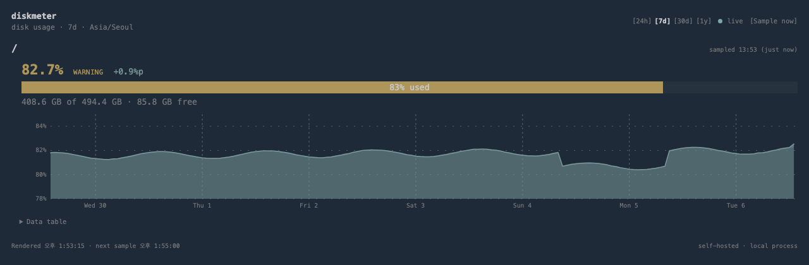
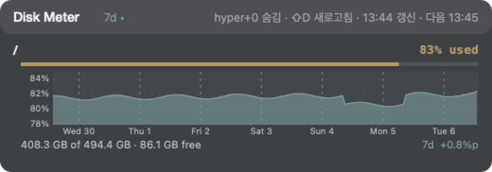
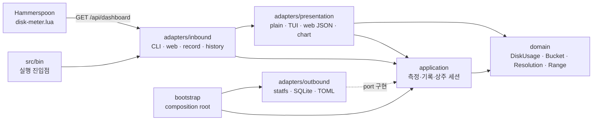

# diskmeter

디스크 사용량을 5분마다 재서 **24시간 · 7일 · 30일(· 1년)** 이력을 남기고, 터미널 · 웹 브라우저 ·
Hammerspoon 패널에서 같은 차트로 보여 주는 CLI 입니다.
[agentmeter](https://github.com/yoophi/agentmeter) 와 같은 기술 스택과 구조(Rust · clap · ratatui ·
axum · rusqlite · 헥사고날 아키텍처)로 만들었고, Hammerspoon 패널도 같은 오버레이 스타일을 씁니다.

```
$ diskmeter
 /
  ████████████████████████████████████████░░░░░░░░  83% used
  408.3 GB of 494.4 GB · 86.1 GB free
  ▂▂▂▂▂▃▃▃▃▃▃▄▄▄▄▄▄▄▄▅▅▅▅▅▅▅▅▅▆▆▆▆▆▆▆▆▆▆▇▇▇▇▇▇▇▇▇  24h · 80–85% · +0.4%p
  sampled 13:33 (just now)
```

게이지는 소진율, 아래 줄은 선택한 기간(기본 24시간)의 Sparkline 입니다. Sparkline 의 세로축은
0~100% 가 아니라 **그 기간의 실제 변화 폭**(`80–85%`)에 맞춥니다 — 디스크는 하루에 1%p 도 안
움직이는 날이 많아 고정 축에서는 아무것도 읽히지 않기 때문입니다. 대신 축 범위를 항상 옆에 적어
배율을 알 수 있게 합니다. `+0.4%p` 는 기간의 첫 표본 대비 변화량입니다.

마지막 줄은 그 숫자가 **언제 기준인지** 밝힙니다.

같은 이력을 웹 대시보드와 Hammerspoon 패널에서도 봅니다 (아래 그림은 합성 데이터입니다).





## 사용법

### 설치

Homebrew tap 으로 설치하고 이후 릴리스도 `brew upgrade` 로 받을 수 있습니다.

```bash
brew install yoophi/tap/diskmeter
brew upgrade diskmeter
```

cargo 로 직접 받으려면 `cargo install --git https://github.com/yoophi/diskmeter --tag 2026.10.2`,
체크아웃한 작업 트리에서는 `cargo install --path .` 입니다.

### 명령

```bash
diskmeter                          # 지금 재고 24시간 Sparkline 과 함께 출력 (표본도 남긴다)
diskmeter -r 7d                    # 7일 이력으로
diskmeter --json                   # 스크립트·statusline 용 JSON
diskmeter -w                       # 상주 TUI: 1~4 로 기간 전환, Tab 순환, r 즉시 표본, q 종료
diskmeter web --port 9998          # 웹 대시보드 + 터미널 화면. Hammerspoon 패널이 읽는 주소
diskmeter record                   # 표본 하나만 남기고 종료 (launchd·cron 용)
diskmeter history -r 30d           # 저장된 이력을 표로
diskmeter history -r 7d -f csv     # CSV 로 (json 도 가능)
diskmeter --path /Volumes/Backup   # 설정과 무관하게 이번 실행만 다른 경로 (반복 가능)

diskmeter config list
diskmeter config set paths=/,/Volumes/Backup
```

설정은 `~/.config/diskmeter/config.toml` (`XDG_CONFIG_HOME` 을 존중합니다), 이력은
`~/.cache/diskmeter/history.sqlite3` 에 있습니다. 설정 파일이 없으면 `/` 하나를 감시합니다.

```toml
paths = ["/", "/Volumes/Backup"]
```

경로 하나가 빠져 있어도(외장 디스크를 뽑은 경우) 나머지는 그대로 보여 주고 그 경로만 오류를
표시합니다. 종료 코드는 모든 경로가 성공했을 때만 0 입니다.

```
$ diskmeter history -r 7d
# / · 7d · 1h buckets · 169 rows
time               used%         avg         min         max        last       total    n
2026-09-29 13:00    81.6    403.6 GB    403.2 GB    404.1 GB    403.9 GB    494.4 GB   12
…
```

### 이력 보관

| 보기 | 해상도 | 보존 기간 | 행 수 (경로당) |
|---|---|---|---|
| 24h | 5분 | 48시간 | ≤ 576 |
| 7d | 1시간 | 14일 | ≤ 336 |
| 30d, 1y | 1일 (로컬 자정 기준) | 400일 | ≤ 400 |

"1일은 5분, 7일은 1시간, 30일은 1일 간격" 을 그대로 쓰되 **보존 기간은 보기보다 넉넉하게**
잡았습니다. 보기와 보존이 같으면 차트 왼쪽 끝이 늘 비어 있고, 더 성긴 해상도를 만들 때
소스가 잘려 나가기 때문입니다. 하루 버킷은 400일을 두어 1년 보기까지 공짜로 얻습니다 —
행 수백 개라 비용이 없습니다.

버킷마다 평균뿐 아니라 **최소 · 최대 · 마지막** 을 함께 남겨 성긴 해상도에서도 하루 안의
출렁임이 사라지지 않습니다. 웹과 Hammerspoon 차트는 이 범위를 띠로 그립니다.
집계와 정리 규칙은 [docs/history-retention.md](docs/history-retention.md) 를 보세요.

### 웹 대시보드

```bash
diskmeter web                      # 127.0.0.1 의 임시 포트
diskmeter web --port 9998          # 고정 포트
diskmeter web --host 0.0.0.0       # 모든 IPv4 인터페이스에 바인딩 (인증·TLS 없음)
diskmeter web -n 60                # 60초마다 표본 (기본 300초, 최소 10초)
```

볼륨마다 소진율 · 용량 · 선택한 기간의 area chart 를 보여 줍니다. 차트 위에 마우스를 올리면
그 시각의 사용량과 (성긴 해상도에서는) 버킷 안 최소~최대가 뜨고, 같은 수치를 표로도 펼 수
있습니다. 상단에서 24h / 7d / 30d / 1y 를 고르며 `?range=7d` 로 열면 그 기간으로 시작합니다.
기록이 끊긴 구간은 이어 그리지 않고 비워 둡니다.

| 경로 | 설명 |
|---|---|
| `GET /` | 대시보드. HTML · CSS · JS 는 바이너리에 포함되어 있어 외부 CDN 이 필요 없습니다 |
| `GET /api/dashboard?range=24h` | 화면이 그리는 JSON. Hammerspoon 패널도 이것을 읽습니다 |
| `GET /api/history?path=/&range=7d` | 선택한 경로 · 기간의 버킷 행 (`diskmeter history -f json` 과 같은 형식) |
| `POST /api/refresh` | 지금 표본을 뜹니다 |

터미널이 화면으로 쓸 수 있으면 `web` 은 서버를 배경으로 돌리고 `-w` 와 같은 TUI 를 함께
띄웁니다. 두 화면은 하나의 세션을 공유하므로 표본은 한 번만 뜹니다. 출력이 터미널이 아니면
주소만 출력하고 서버만 남습니다. 자세한 내용은 [docs/web-dashboard.md](docs/web-dashboard.md).

### Hammerspoon 패널

`hammerspoon/disk-meter.lua` 를 `~/.hammerspoon/` 에 두고 `init.lua` 에 한 줄을 더합니다.
Agent Meter 패널과 같은 `overlay-style.lua` · `hyper.lua` 를 쓰므로 그 둘이 있어야 합니다.

```lua
require("disk-meter").start()
```

- 볼륨마다 24h 와 7d 차트를 위아래로 함께 보여 줍니다. `hyper+d` 표시/숨김, `hyper+shift+d` 즉시 새로고침, 헤더의 `24h·7d ▸` 를 클릭하면 30d·1y 묶음으로 바뀝니다.
- `hammerspoon/overlay-all.lua` 를 함께 두면 `hyper+h` 로 Agent Shortcuts · Cockpit · Meter · Disk Meter 패널을 한 번에 숨기고 되살립니다.
- `hammerspoon/overlay-layout.lua` 를 함께 두면 패널들이 같은 폭 · 같은 간격으로 주 화면 우측 하단부터 위로 쌓이고, 높이가 바뀌면 위 패널이 따라 올라갑니다. 드래그한 패널은 고정되고, `hyper+t` 는 손으로 놓은 배치를 유지한 채 격자에 맞추며, `hyper+shift+h` 는 정해진 순서로 다시 쌓습니다.
- `hammerspoon://diskmeter-toggle` · `diskmeter-refresh` · `diskmeter-range?range=24h,7d` · `diskmeter-move?x=&y=`
- `diskmeter web --port 9998` 이 떠 있지 않으면 명령 복사 · 터미널 실행 버튼을 보여 줍니다.

자세한 내용은 [docs/hammerspoon.md](docs/hammerspoon.md).

### 상주시키기 (launchd)

웹 서버가 곧 수집기입니다. 로그인할 때마다 뜨게 하려면:

```bash
contrib/launchd/install.sh          # ~/Library/LaunchAgents/com.yoophi.diskmeter.plist, 포트 9998
contrib/launchd/install.sh 9000     # 다른 포트
contrib/launchd/install.sh --remove
```

서버 없이 표본만 남기고 싶으면 `diskmeter record` 를 cron 이나 launchd `StartInterval` 300 으로
돌려도 됩니다. 여러 프로세스가 같은 5분 버킷에 쓰더라도 표본 시각이 버킷 경계에 맞춰져 있어
한 버킷으로 합쳐질 뿐 깨지지 않습니다.

## 동작 방식

- **측정**: `statfs(2)`. `df` 와 같은 계산이며 블록 수가 64비트라 macOS `statvfs` 의 16 TiB
  한계가 없습니다. 용량은 Finder 와 같은 SI 단위(1 GB = 10⁹ B)로 표시합니다. 소진율은
  `used / total` 이고 APFS 에서는 `df` 의 `Use%` 와 같습니다 (ext4 처럼 루트 예약 블록이 있는
  파일시스템에서는 `df` 보다 몇 %p 낮게 나옵니다).
- **심각도**: 80% 이상 warning, 90% 이상 critical. 색과 함께 글자(`warning`)로도 표시합니다.
- **표본 시각**: 주기의 배수(:00, :05 …)에 맞춥니다. 어느 프로세스가 떠 있든 같은 버킷을 채웁니다.
- **일회성 실행도 표본을 남깁니다.** 측정이 곧 기록이고, 가끔 손으로만 돌려도 이력이 쌓입니다.

## 아키텍처

agentmeter 와 같은 헥사고날 구조입니다. 안쪽 module 은 파일시스템, HTTP, 터미널 framework 를
알지 못합니다.



| 위치 | 책임 | 알면 안 되는 것 |
|---|---|---|
| `src/domain/` | 바이트 수, 버킷 집계, 해상도 · 기간 규칙 | statfs, SQLite, 화면 문구 · 색 |
| `src/application/` | 측정 · 기록 · 이력 조회 사용 사례, 상주 세션, outbound port | Clap, ratatui, HTTP · 파일 구현 |
| `src/adapters/inbound/` | CLI 문법, TUI · 웹 실행 모드 | 저장소 스키마, 측정 세부 |
| `src/adapters/outbound/` | `statfs`, SQLite 집계 · 정리, TOML 설정 | 화면 모델 |
| `src/adapters/presentation/` | 화면 모델, 차트 좌표 투영, plain · TUI · JSON | 측정, 저장 |
| `src/bootstrap.rs` | 구체 adapter 를 port 에 연결 | 비즈니스 규칙 |

자세한 설계는 [docs/architecture.md](docs/architecture.md).

## 개발

```bash
cargo fmt --all -- --check
cargo clippy --all-targets -- -D warnings
cargo test
```

규칙은 [AGENTS.md](AGENTS.md) 를 봅니다.

## 배포

릴리스를 publish 하면 `.github/workflows/publish-homebrew.yml` 이 태그와 같은 버전의 소스
tarball 체크섬을 계산해 [yoophi/homebrew-tap](https://github.com/yoophi/homebrew-tap) 의
`Formula/diskmeter.rb` 를 갱신하고 `brew audit` · `brew install` · `brew test` 를 거쳐 푸시합니다.
tap 저장소에 쓰는 deploy key 는 이 저장소의 `HOMEBREW_TAP_DEPLOY_KEY` secret 입니다.

## 버전 정책

zero-padding 없는 CalVer `YYYY.M.#` 입니다. 작업 트리에서 설치한 개발 빌드는
`diskmeter --version` 에 커밋 해시가 붙습니다 — `2026.10.1-2879224`, 커밋하지 않은 변경이 있으면
`2026.10.1-2879224-dirty`.

## 라이선스

[MIT License](LICENSE)
