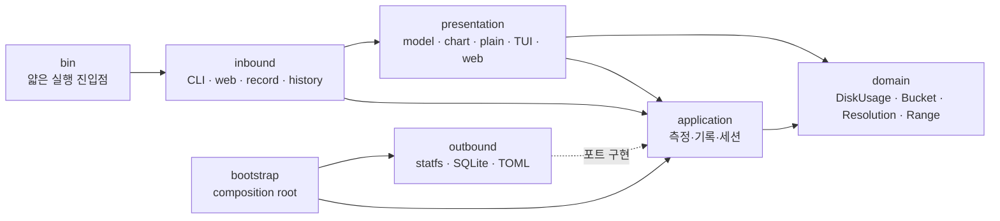
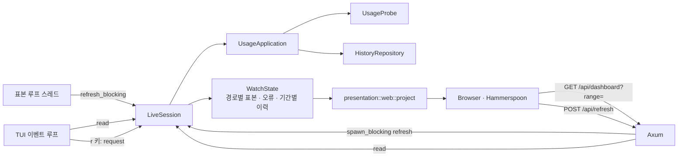
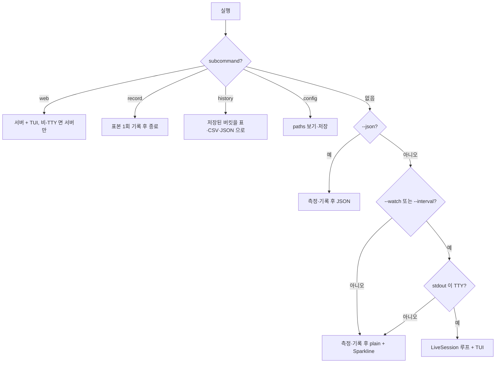

# 아키텍처

`diskmeter` 는 agentmeter 와 같은 헥사고날 구조입니다. 핵심 규칙이 `statfs`, SQLite, HTTP,
터미널 기술에 의존하지 않도록 계층을 나누고, 의존성은 바깥에서 안쪽으로만 향합니다.

- `src/domain/disk.rs` — `DiskUsage`, `Sample`, `Bucket`, `Resolution`(5m · 1h · 1d),
  `Range`(24h · 7d · 30d · 1y), 순수 함수 `rollup`
- `src/application/` — `UsageApplication`(측정 · 기록 · 이력 조회), `SettingsApplication`,
  `LiveSession`(상주 표본 루프), 포트 `UsageProbe` · `HistoryRepository` · `SettingsRepository`
- `src/adapters/outbound/statfs.rs` — `statfs(2)` 측정기
- `src/adapters/outbound/history.rs` — SQLite 집계 · 정리
- `src/adapters/outbound/config.rs` — TOML 설정 저장소
- `src/adapters/presentation/` — 화면 모델 투영, 차트 좌표, plain · TUI · JSON · 웹 자산
- `src/adapters/inbound/` — CLI 문법과 실행 모드, Axum 서버
- `src/bootstrap.rs` — 구체 어댑터를 포트에 연결하는 유일한 composition root

## 포트

| 포트 | 의미 | 프로덕션 구현 | 테스트 구현 |
|---|---|---|---|
| `UsageProbe` | 경로 하나의 `DiskUsage` 를 잰다 | `StatfsProbe` | `FixedProbe` |
| `HistoryRepository` | 표본을 기록하고 해상도별 버킷을 읽는다 | `SqliteHistoryRepository` | `MemoryHistory` |
| `SettingsRepository` | 감시 경로 목록 | `FileSettingsRepository` | `MemorySettings` |

`HistoryRepository::record` 는 raw 저장이 아니라 "표본 하나를 반영한다" 는 lifecycle 입니다.
5분 버킷 갱신, 시간 · 일 집계, 보존 기한 정리를 어댑터가 한 트랜잭션으로 끝내고 애플리케이션은
그 사실을 모릅니다.

## 상주 세션

`LiveSession` 이 측정 루프 하나를 소유합니다. TUI 와 웹은 그 상태를 읽는 두 개의 화면일 뿐이라
**화면이 둘이어도 측정과 기록은 한 번만** 일어납니다.

- 루프는 다음 표본 시각을 **주기의 배수**(:00, :05 …)에 맞춥니다. 어느 프로세스가 떠 있든 같은
  5분 버킷을 채웁니다.
- 표본을 뜬 뒤 네 기간의 이력을 저장소에서 다시 읽어 `WatchState` 에 둡니다. HTTP 요청은
  메모리의 상태만 읽으므로 디스크를 다시 열지 않습니다.
- 측정 · 기록은 `Mutex` 로 직렬화합니다. 키 입력(`r`)은 큐에 요청만 넣고 루프가 집어가며,
  `POST /api/refresh` 는 결과를 돌려줘야 하므로 `spawn_blocking` 에서 끝까지 실행합니다.
- 경로 하나의 측정이 실패하면 그 pane 에 오류를 남기고 직전 표본은 유지합니다.

## 차트 투영

`presentation::chart::project` 가 버킷을 viewBox `0 0 1000 100` 좌표로 바꿉니다. 세로축 범위,
눈금, 시간 경계(midnight · hour · week · month), 점 목록, SVG path(line · area · min~max band)를
모두 Rust 가 계산하고 브라우저와 Hammerspoon 은 그리기만 합니다. TUI 는 같은 버킷을
`sparkline_cells` 로 접어 ratatui `Sparkline` 에 넣습니다. 세 화면이 같은 세로축 규칙
(`y_domain`)과 같은 공백 규칙(`segments`)을 쓰므로 어디서 보든 같은 모양입니다.

## 실행 모드

## 개발 준수 사항

- domain 에는 경로 문자열의 의미, SQL, 시간대 문구, 색, 렌더링 문구, I/O 를 넣지 않습니다.
  (예외: 하루 버킷의 로컬 자정 계산은 도메인 규칙이므로 `chrono::Local` 을 씁니다.)
- application 은 사용 사례의 순서를 소유합니다. 호출자가 `measure → record → history` 를 조립하지
  않습니다.
- outbound 어댑터는 화면 값을 만들지 않습니다. presentation 어댑터는 측정 · 저장을 하지 않습니다.
- 구체 어댑터 생성은 `bootstrap.rs` 에서만 합니다.
- 테스트는 실제 HOME, 설정 파일, 캐시를 바꾸지 않습니다. SQLite 테스트는 임시 디렉터리를 씁니다.
