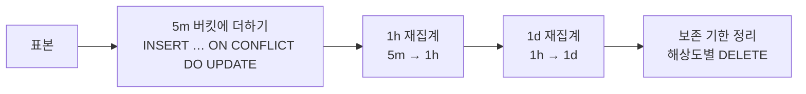

# 이력 보관

## 세 해상도

| 해상도 | 버킷 경계 | 보존 | 쓰는 보기 | 소스 |
|---|---|---|---|---|
| `5m` | UTC 5분 격자 | 48시간 | 24h | 표본 |
| `1h` | UTC 1시간 격자 | 14일 | 7d | `5m` |
| `1d` | **로컬 자정** | 400일 | 30d, 1y | `1h` |

하루 버킷만 로컬 자정에 맞추는 이유는 "어제 하루" 가 화면의 하루와 같아야 하기 때문입니다.
5분 · 1시간 버킷은 시간대와 무관하게 UTC 격자를 씁니다.

보존 기간은 보기보다 깁니다. 보기와 같으면 (1) 차트 왼쪽 끝이 항상 비고 (2) 더 성긴 해상도를
만드는 소스가 기한에 걸려 잘립니다. 하루 버킷은 1년 보기를 위해 400일을 둡니다.

## 버킷에 남기는 것

```
start, total, used_min, used_max, used_sum, used_last, available_last, samples
```

`used_sum / samples` 가 평균입니다. 평균만 남기면 성긴 해상도에서 하루 안의 출렁임이
사라지므로 최소 · 최대 · 마지막을 함께 둡니다. 두 버킷을 합칠 때 최소 · 최대는 각각 더 작은 ·
큰 쪽, 합과 표본 수는 더하고, 마지막 값과 `total` 은 뒤에 온 쪽을 씁니다
(`domain::disk::Bucket::absorb`). 합과 표본 수를 함께 두기 때문에 성긴 버킷의 평균은 가중
평균으로 정확합니다.

## 기록할 때 일어나는 일

표본 하나를 기록하면 같은 SQLite 트랜잭션 안에서 네 단계가 끝납니다.



재집계는 `domain::disk::rollup` 이라는 순수 함수가 합니다 — SQL 이 아니라 Rust 에서 그룹을
나누므로 로컬 자정 같은 규칙을 테스트할 수 있고, 행 수가 수백 개라 비용이 없습니다.

### 어디서부터 다시 세는가

소스 행은 보존 기한이 지나면 지워지므로, 기한이 걸친 버킷은 앞쪽이 잘렸을 수 있습니다.
그래서 **소스 보존 기한 이후 첫 경계부터만** 다시 셉니다.

```
cutoff = now − source.retention()
from   = resolution.first_boundary_at_or_after(cutoff)
rows   = SELECT source WHERE bucket >= from
```

그 앞의 버킷은 소스가 온전하던 때 센 값이 그대로 남습니다. 집계가 정리보다 먼저 실행되고,
어떤 버킷의 소스 행이 지워지기 전 마지막 실행에서는 그 버킷이 아직 재집계 범위 안에
있었으므로 남는 값은 완전합니다. 프로세스가 며칠 꺼져 있다 돌아와도 같은 논리가 성립합니다 —
그 사이 새 표본이 없었으니 마지막 집계가 곧 완전한 집계입니다.

이 규칙 덕분에 수집을 시작한 첫 시간 · 첫 날처럼 **원래 표본이 적은 버킷** 도 그대로 남습니다.
적게 측정된 것과 잘린 것은 다릅니다.

### 동시에 여러 프로세스가 써도 되는가

됩니다. 표본 시각이 주기의 배수에 맞춰져 있어 `diskmeter web`, `diskmeter -w`, 손으로 돌린
`diskmeter` 가 같은 5분 버킷에 쓰면 `samples` 가 늘어날 뿐입니다. 연결마다 `busy_timeout` 5초와
WAL 모드를 쓰므로 상주 프로세스가 쓰는 동안 `diskmeter history` 가 읽어도 서로 막지 않습니다.

## 차트에서의 공백

버킷 간격이 버킷 길이의 3배를 넘으면 기록이 끊긴 것으로 보고 선과 면을 끊습니다
(`presentation::chart::segments`). 수집이 멈춘 시간을 직선으로 이으면 없는 측정을 있는 것처럼
보이게 하기 때문입니다. 짧은 지연으로 표본 하나가 빠진 것은 끊지 않습니다. 공백 뒤 홀로 남은
표본은 점으로 그립니다.

## 스키마

```sql
CREATE TABLE schema_version (version INTEGER NOT NULL);
CREATE TABLE history (
    resolution     TEXT    NOT NULL,   -- '5m' | '1h' | '1d'
    path           TEXT    NOT NULL,
    bucket         INTEGER NOT NULL,   -- 버킷 시작, epoch 초
    total          INTEGER NOT NULL,
    used_min       INTEGER NOT NULL,
    used_max       INTEGER NOT NULL,
    used_sum       INTEGER NOT NULL,
    used_last      INTEGER NOT NULL,
    available_last INTEGER NOT NULL,
    samples        INTEGER NOT NULL,
    PRIMARY KEY (resolution, path, bucket)
);
```

파일은 `~/.cache/diskmeter/history.sqlite3` 입니다. 이 빌드가 모르는 더 새로운 스키마 버전을
만나면 고쳐 쓰지 않고 오류로 멈춥니다.
